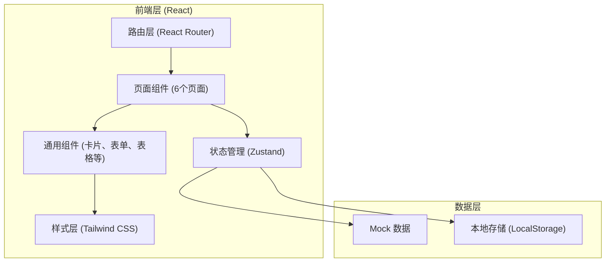
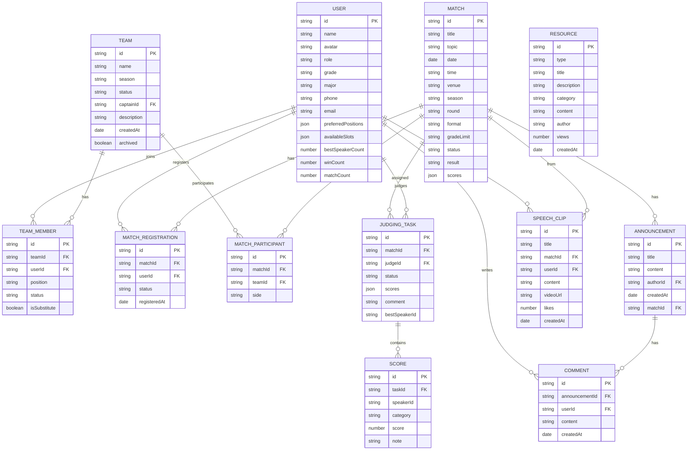

## 1. 架构设计



## 2. 技术描述

- **前端框架**: React 18 + TypeScript
- **构建工具**: Vite 5
- **样式方案**: Tailwind CSS 3
- **状态管理**: Zustand
- **路由方案**: React Router DOM 6
- **图标库**: Lucide React
- **后端**: 无后端，使用 Mock 数据 + LocalStorage 持久化
- **初始化工具**: vite-init (react-ts 模板)

## 3. 路由定义

| 路由路径 | 页面名称 | 说明 |
|----------|----------|------|
| `/` | 首页 | 近期比赛、积分榜、公告栏、报名入口 |
| `/members` | 成员页 | 个人资料、辩论能力、历史战绩 |
| `/teams` | 组队页 | 队伍列表、创建队伍、队伍管理 |
| `/schedule` | 赛程页 | 报名管理、抽签编排、比赛日程、结果回填 |
| `/judging` | 评审页 | 评审任务、打分面板、评语与最佳辩手 |
| `/resources` | 资料页 | 辩题卡库、立论模板、训练录像、优秀发言 |

## 4. 数据模型

### 4.1 实体关系图



### 4.2 状态管理 (Zustand Store)

```typescript
// 用户状态
interface UserState {
  currentUser: User | null;
  users: User[];
  setCurrentUser: (user: User) => void;
  updateUser: (id: string, data: Partial<User>) => void;
}

// 比赛状态
interface MatchState {
  matches: Match[];
  registrations: MatchRegistration[];
  addMatch: (match: Match) => void;
  updateMatch: (id: string, data: Partial<Match>) => void;
  registerMatch: (matchId: string, userId: string) => void;
  approveRegistration: (id: string) => void;
}

// 队伍状态
interface TeamState {
  teams: Team[];
  teamMembers: TeamMember[];
  createTeam: (team: Team, members: TeamMember[]) => void;
  updateTeam: (id: string, data: Partial<Team>) => void;
  addMember: (teamId: string, member: TeamMember) => void;
  removeMember: (teamMemberId: string) => void;
  archiveTeam: (id: string) => void;
}

// 评审状态
interface JudgeState {
  tasks: JudgingTask[];
  submitScore: (taskId: string, scores: Score[], comment: string, bestSpeakerId: string) => void;
}

// 资源状态
interface ResourceState {
  resources: Resource[];
  speechClips: SpeechClip[];
  announcements: Announcement[];
  comments: Comment[];
  addAnnouncement: (announcement: Announcement) => void;
  addComment: (comment: Comment) => void;
  likeSpeech: (id: string) => void;
}
```

## 5. 项目目录结构

```
src/
├── components/           # 通用组件
│   ├── layout/           # 布局组件 (Header, Sidebar, Footer)
│   ├── ui/               # 基础 UI 组件 (Button, Card, Modal, Badge, etc.)
│   └── features/         # 业务组件 (MatchCard, TeamCard, ScorePanel, etc.)
├── pages/                # 页面组件
│   ├── Home.tsx
│   ├── Members.tsx
│   ├── Teams.tsx
│   ├── Schedule.tsx
│   ├── Judging.tsx
│   └── Resources.tsx
├── store/                # Zustand 状态管理
│   ├── useUserStore.ts
│   ├── useMatchStore.ts
│   ├── useTeamStore.ts
│   ├── useJudgeStore.ts
│   └── useResourceStore.ts
├── types/                # TypeScript 类型定义
│   └── index.ts
├── data/                 # Mock 数据
│   ├── users.ts
│   ├── matches.ts
│   ├── teams.ts
│   ├── resources.ts
│   └── index.ts
├── utils/                # 工具函数
│   ├── date.ts
│   ├── score.ts
│   └── storage.ts
├── App.tsx               # 根组件
├── main.tsx              # 入口文件
├── index.css             # 全局样式 (Tailwind 基础)
└── router.tsx            # 路由配置
```

## 6. 核心业务逻辑

### 6.1 冲突时间检测

```typescript
function checkTimeConflict(userId: string, newMatchDate: Date, newMatchTime: string): Match[] {
  // 检查该用户已报名/已分配的比赛是否与新比赛时间冲突
  return userMatches.filter(m => 
    m.date === newMatchDate && 
    isTimeOverlap(m.time, newMatchTime)
  );
}
```

### 6.2 积分榜计算

```typescript
function calculateLeaderboard(matches: Match[], teams: Team[]): LeaderboardEntry[] {
  // 胜一场积3分，平1分，负0分
  // 最佳辩手额外加1分
  // 按积分 > 净胜分 > 胜负关系排序
}
```

### 6.3 抽签算法

```typescript
function drawLots(teams: Team[], format: string): BracketMatch[] {
  // 根据赛制（单败淘汰、循环赛等）生成对阵图
  // 随机打乱队伍顺序后配对
}
```

### 6.4 评分加权计算

```typescript
function calculateTotalScore(scores: Score[], weights: Record<string, number>): number {
  // 立论(30%)、攻辩(25%)、自由辩(25%)、总结(20%)
  return scores.reduce((sum, s) => sum + s.score * (weights[s.category] || 1), 0);
}
```
