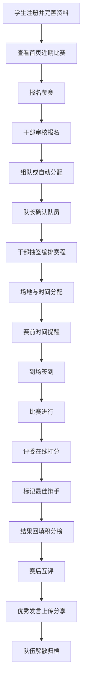

## 1. 产品概述

面向高校辩论社团的一体化协作管理平台，覆盖招新、组队、赛程、评审到复盘的全流程，服务社团干部、评委和参赛学生三类角色，实现校内辩论赛从招募到归档的闭环管理。

## 2. 核心功能

### 2.1 用户角色

| 角色 | 注册方式 | 核心权限 |
|------|----------|----------|
| 社团干部 | 管理员邀请 | 发布比赛、审核报名、抽签编排、分配场地、管理积分榜、发布公告、队伍归档 |
| 评委 | 管理员邀请 | 接收评审任务、在线打分、写评语、标记最佳辩手、查看历史评审记录 |
| 参赛学生 | 自主注册 | 完善个人资料、报名比赛、发起/加入组队、签到、赛后互评、查看积分榜、上传分享发言 |

### 2.2 功能模块

1. **首页**：近期比赛展示、报名入口、积分榜、公告栏、评论互动
2. **成员页**：个人资料维护、擅长立场设置、可参赛时段配置、历史成绩记录、荣誉展示
3. **组队页**：队长发起组队、候补替补管理、队内成员确认、临时人员调整、队伍解散
4. **赛程页**：报名审核、年级/组别限制、抽签分组、轮次编排、场地分配、时间提醒、到场签到、冲突检测
5. **评审页**：打分面板、评语输入、最佳辩手标记、评审进度、结果回填
6. **资料页**：辩题卡库、立论模板、训练录像、优秀发言摘录与分享

### 2.3 页面详情

| 页面名称 | 模块名称 | 功能描述 |
|----------|----------|----------|
| 首页 | 英雄区域 | 展示社团口号、当前赛季主题、快速报名入口 |
| 首页 | 近期比赛 | 卡片列表展示即将开始的比赛，含时间、地点、参赛队伍、报名状态 |
| 首页 | 积分榜 | 按赛季展示各队伍积分排名，支持切换查看 |
| 首页 | 公告栏 | 社团干部发布的通知，支持评论互动 |
| 成员页 | 个人资料 | 头像、姓名、年级、专业、联系方式编辑 |
| 成员页 | 辩论能力 | 擅长立场（一辩/二辩/三辩/四辩）、风格标签、可参赛时段选择器 |
| 成员页 | 历史战绩 | 参与比赛列表、胜负记录、最佳辩手次数、荣誉徽章 |
| 组队页 | 队伍列表 | 当前赛季所有队伍，显示队长、成员、状态（招募中/已满/已确认） |
| 组队页 | 创建队伍 | 队长创建、设置队伍名称、招募人数、招募备注、邀请成员 |
| 组队页 | 队伍管理 | 成员确认、候补替补、临时调人、解散队伍、归档 |
| 赛程页 | 报名管理 | 审核报名、年级/组别限制筛选、冲突时间检测提示 |
| 赛程页 | 抽签编排 | 自动抽签或手动分组、轮次对阵图生成、场地分配、时间排期 |
| 赛程页 | 比赛日程 | 日历视图展示所有比赛，含提醒设置、签到入口 |
| 赛程页 | 比赛结果 | 结果回填、积分计算、排名更新 |
| 评审页 | 评审任务 | 待评审/已评审比赛列表，显示评审进度 |
| 评审页 | 打分面板 | 各环节评分、加权计算总分、实时预览 |
| 评审页 | 评语与最佳辩手 | 结构化评语输入、最佳辩手选择、提交确认 |
| 资料页 | 辩题卡库 | 分类浏览辩题、搜索、收藏、下载 |
| 资料页 | 立论模板 | 各种赛制的立论框架模板、可在线编辑 |
| 资料页 | 训练录像 | 视频列表、分类标签、播放统计 |
| 资料页 | 优秀发言 | 会员上传的精彩片段、点赞、评论、分享 |

## 3. 核心流程

## 4. 用户界面设计

### 4.1 设计风格

- **主色调**：深邃靛蓝 `#1e3a5f` 搭配暖铜金 `#c9a962`，传达学术思辨与荣誉质感
- **辅助色**：米白 `#f5f1e8` 背景，墨灰 `#2d2d2d` 文字，胜利红 `#c0392b` 与通过绿 `#27ae60` 状态色
- **按钮风格**：圆角方形按钮，带细边框，悬停时有微妙的光泽过渡与阴影加深
- **字体**：标题使用「思源宋体」体现学术庄重，正文使用「思源黑体」保证可读性，数字与比分使用等宽字体
- **布局风格**：卡片式布局配合微妙的边框与阴影，顶部导航栏固定，左侧二级导航在主要功能页显示
- **图标风格**：线性图标搭配少量填充图标，统一笔画粗细，使用 Lucide 图标库
- **装饰元素**：辩论相关的几何图形（天平、引号、对话气泡）作为页面点缀，细微的网点纹理背景

### 4.2 页面设计概览

| 页面名称 | 模块名称 | UI 元素 |
|----------|----------|---------|
| 首页 | 英雄区域 | 大标题使用思源宋体加粗，背景为渐变靛蓝叠加辩论剪影，报名按钮为暖铜金渐变，入场动画为淡入上浮 |
| 首页 | 近期比赛 | 卡片含微妙边框，hover 时卡片轻微上浮并显示阴影，比赛状态用标签色标区分 |
| 首页 | 积分榜 | 表格前三名使用金/银/铜色背景强调，排名变化用上下箭头指示 |
| 成员页 | 个人资料 | 左右分栏布局，左侧头像与基本信息，右侧标签页切换能力/战绩/设置 |
| 成员页 | 辩论能力 | 立场选择用图标卡片形式，可参赛时段用周历热力图展示 |
| 组队页 | 队伍列表 | 网格布局展示队伍卡片，队长徽章突出显示，成员用头像堆叠展示 |
| 组队页 | 创建队伍 | 分步表单，带进度指示，邀请成员支持搜索与快捷选择 |
| 赛程页 | 抽签编排 | 对阵图使用树形可视化，拖拽式场地分配，时间轴展示赛程 |
| 赛程页 | 比赛日程 | 月/周/日三种日历视图切换，比赛项用不同颜色区分赛制 |
| 评审页 | 打分面板 | 左右分栏，左侧队伍与选手列表，右侧评分滑块与输入框，底部实时总分预览 |
| 资料页 | 资源浏览 | 分类侧边栏 + 卡片网格，支持瀑布流布局展示辩题卡与模板 |

### 4.3 响应式设计

- 采用桌面优先设计，主断点 1024px、768px、480px
- 移动端顶部导航折叠为汉堡菜单，侧边导航转为底部 Tab 栏
- 表格在移动端转为卡片堆叠展示
- 日历视图在移动端默认展示日视图，支持手势滑动切换
- 打分面板在移动端改为上下堆叠布局

### 4.4 动效与交互

- 页面加载时元素按序淡入（staggered reveal），延迟 50ms 递增
- 卡片 hover 有 4px 上浮与阴影加深，过渡时长 200ms
- 按钮点击有轻微缩放反馈（scale 0.97）
- 积分榜数据变化时有数字滚动动画
- 对阵图抽签时有随机洗牌的动态效果
- 侧边导航切换使用平滑滑入过渡
